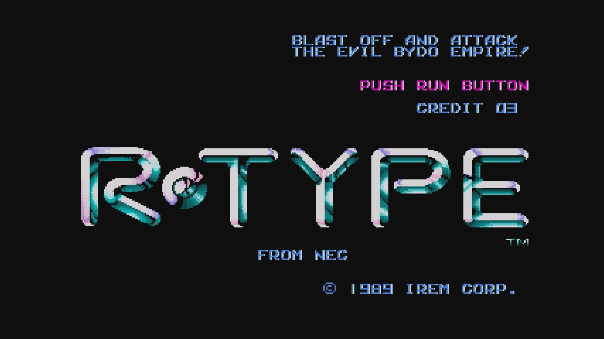

# Rtype



Rtype est un jeu d'action spatial qui vous met aux commandes d'un vaisseau spatial, naviguant à travers différents niveaux tout en combattant des ennemis et en esquivant les obstacles.

## Installation

Des installateurs précompilés (setup) sont disponibles pour tous les systèmes d'exploitation : macOS, Windows et Linux. Vous pouvez les télécharger dans la section [Releases](https://github.com/VOTRE_NOM_DUTILISATEUR/Rtype/releases) de ce dépôt.

### Compilation et installation sous Linux & macOS

1. Assurez-vous d'avoir cloné le dépôt ou téléchargé le code source.
2. Ouvrez un terminal dans le dossier du projet.
3. Exécutez le script pour installer les dépendances :
   ```bash
   ./dependencies.sh
    ```
4. Excuter le script pour build le projet :
    ```bash
   ./build.sh
   ```

## Documentation

Pour une compréhension approfondie de Rtype et de ses mécanismes internes, consultez nos documentations détaillées :

- [Game Engine Documentation](docs/GameEngineInstruction.md)
- [RFC Documentation](docs/rfc-rtype-ncp.md)

## Collaborateurs

Nous tenons à remercier tous nos collaborateurs pour leur dévouement et leur travail acharné pour rendre Rtype possible.

- [Théophilus Homawoo](https://github.com/theohmwoa)
- [Harry Viennot](https://github.com/harryviennot)
- [Clément Lagasse](https://github.com/ClementLagasse)
- [Alexandre Lagasse](https://github.com/alexandrelagasse)
- [Bartosz Michalak](https://github.com/Bartoszkk)
