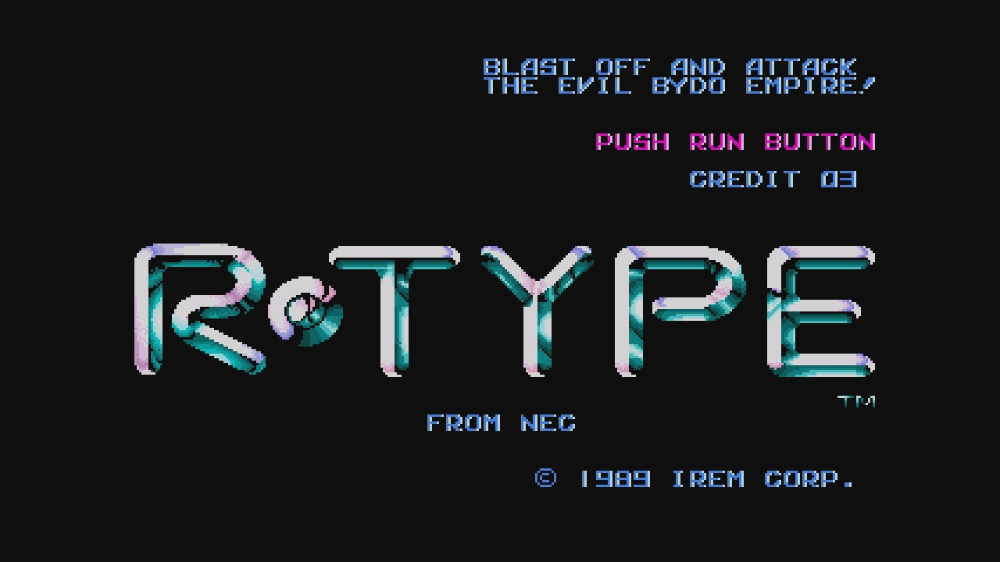

# **Rtype**


---

> **Rtype** is a space action game that puts you in command of a spaceship. Navigate through diverse levels, combat enemies, and dodge obstacles on your journey.

## 🚀 **Installation**

Precompiled installers (setup) are available for:

- 🍏 macOS
- 🖼️ Windows
- 🐧 Linux

🔗 [Download from the Releases section](https://github.com/HarryTheoBartAlexClemDev/Rtype/releases/latest).

### **Compilation and installation on Linux & macOS**

1. Ensure you've cloned the repository or downloaded the source code.
2. Open a terminal in the project folder.
3. Run the script to install the dependencies:
   ```bash
   ./dependencies.sh

4. Run the script to build the project:
    ```bash
   ./build.sh
## 📚 **Documentation**

Dive deeper into **Rtype** and its core mechanisms:

- [🕹️ Game Engine Documentation](docs/GameEngineInstruction.md)
- [📡 RFC Documentation](docs/rfc-rtype-ncp.txt)
- [📡 NetworkLib Documentation](docs/NetworkLibraryDoc.md)

## 🌟 **Contributors**

A heartfelt thank you to our contributors. Your dedication and hard work have made Rtype possible!

- [👤 Théophilus Homawoo](https://github.com/theohmwoa)
- [👤 Harry Viennot](https://github.com/harryviennot)
- [👤 Clément Lagasse](https://github.com/ClementLagasse)
- [👤 Alexandre Lagasse](https://github.com/alexandrelagasse)
- [👤 Bartosz Michalak](https://github.com/Bartoszkk)

---
