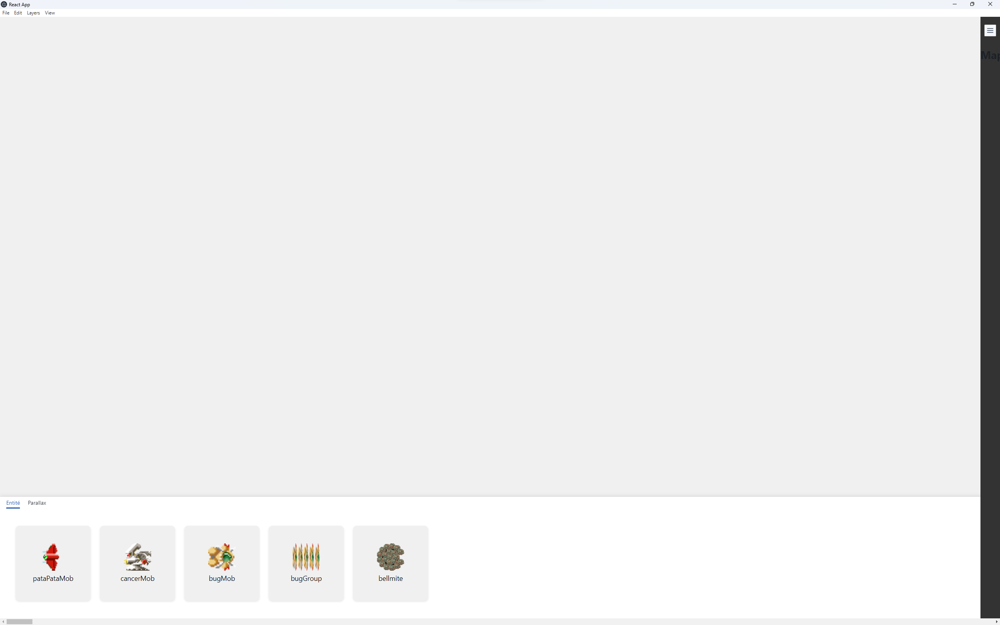

# Nom de l'Application Electron

Bienvenue sur le README de [Nom de l'Application]. Cette application est développée avec Electron, offrant une expérience utilisateur riche et des performances optimales.

## Instructions de Construction et de Lancement

### Construction de l'Application

Pour construire l'application, suivez ces étapes :

1. Ouvrez votre terminal.
2. Naviguez jusqu'au dossier de l'application map-creator.
3. Exécutez la commande suivante :

```
npm run build
```

Cette commande compile l'application et prépare tous les fichiers nécessaires pour le lancement.

### Lancement de l'Application

Une fois la construction terminée, lancez l'application en suivant ces étapes :

1. Toujours dans le terminal, exécutez la commande :

```
npm run electron-start
```

2. L'application devrait démarrer automatiquement.


